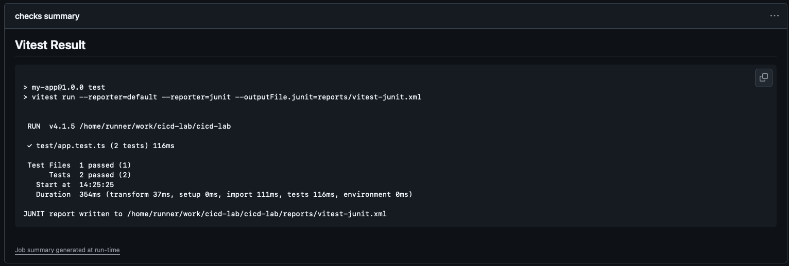
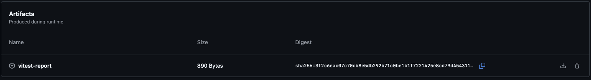
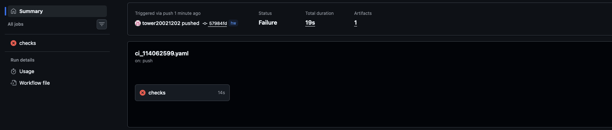
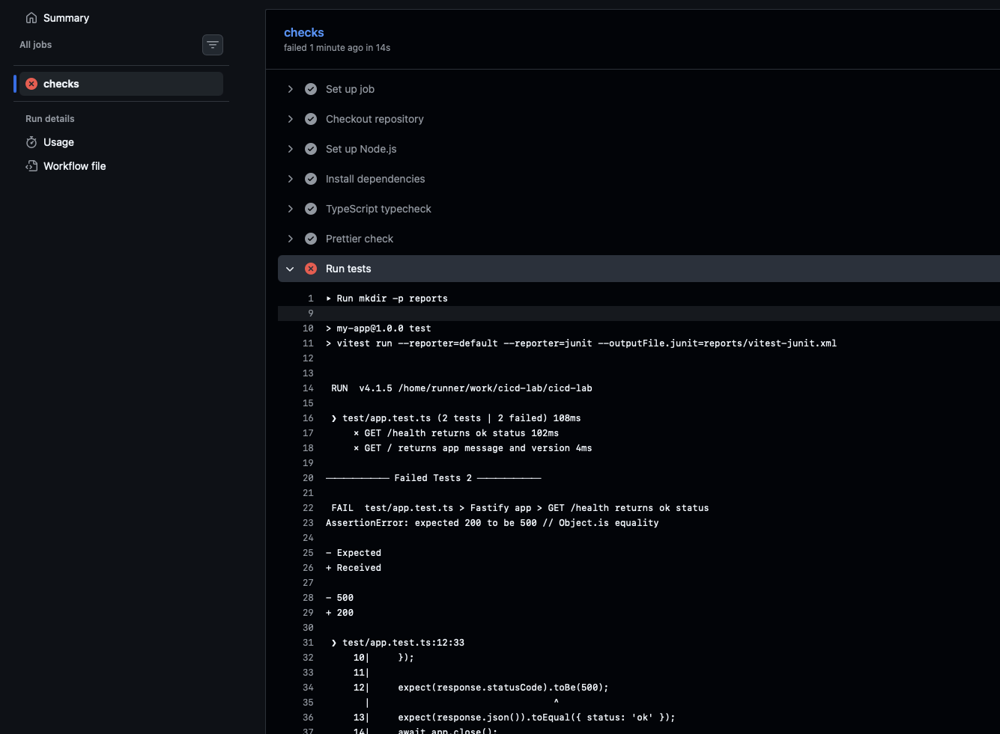
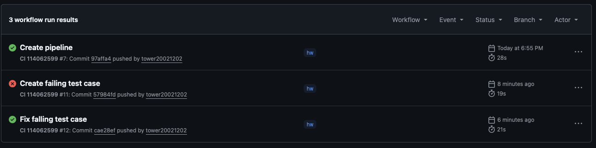

# 114062599_李宗陶_CICD_作業

## 一、作業內容

本次作業目標是在專案中新增 GitHub Actions workflow：

```text
.github/workflows/ci_114062599.yaml
```

此 CI pipeline 需在 push 時自動執行，並包含以下檢查：

- TypeScript typecheck
- Prettier check
- Test
- 任一檢查失敗時，pipeline 顯示失敗
- 測試結果顯示於 GitHub Actions 結果頁面
- 說明實作方式使用工具與策略

## 二、Pipeline 設計

完整的 `.github/workflows/ci_114062599.yaml` 設定如下：

```yaml
name: CI 114062599

on:
  push:
    branches:
      - '**'

permissions:
  contents: read

jobs:
  checks:
    runs-on: ubuntu-latest

    steps:
      - name: Checkout repository
        uses: actions/checkout@v5
      - name: Set up Node.js
        uses: actions/setup-node@v5
        with:
          node-version: '22'
          cache: npm

      - name: Install dependencies
        run: npm ci

      - name: TypeScript typecheck
        run: npm run typecheck

      - name: Prettier check
        run: npm run format:check

      - name: Run tests
        env:
          NO_COLOR: '1'
          FORCE_COLOR: '0'
        run: |
          mkdir -p reports
          set -o pipefail
          npm test -- --reporter=default --reporter=junit --outputFile.junit=reports/vitest-junit.xml 2>&1 | tee reports/test-output.txt

      - name: Publish test summary
        if: always()
        run: |
          echo "## Vitest Result" >> "$GITHUB_STEP_SUMMARY"
          echo '```' >> "$GITHUB_STEP_SUMMARY"
          if [ -f reports/test-output.txt ]; then
            tail -n 80 reports/test-output.txt >> "$GITHUB_STEP_SUMMARY"
          else
            echo "No test output generated." >> "$GITHUB_STEP_SUMMARY"
          fi
          echo '```' >> "$GITHUB_STEP_SUMMARY"

      - name: Upload test report
        if: always()
        uses: actions/upload-artifact@v7
        with:
          name: vitest-report
          path: reports/
          if-no-files-found: warn
```

Workflow 名稱為：

```yaml
name: CI 114062599
```

觸發條件設定為：

```yaml
on:
  push:
    branches:
      - '**'
```

代表只要 push 到任一 branch，就會自動執行此 pipeline。

權限設定為：

```yaml
permissions:
  contents: read
```

此設定讓 workflow 只具備讀取 repository 的權限，符合最小權限原則。

## 三、Job 設計

本 pipeline 使用一個 job：`checks`。

```yaml
jobs:
  checks:
    runs-on: ubuntu-latest
```

`runs-on: ubuntu-latest` 表示 pipeline 會在 GitHub Actions 提供的 Ubuntu runner 上執行。

## 四、Pipeline 執行流程

### 1. Checkout Repository

```yaml
- name: Checkout repository
  uses: actions/checkout@v5
```

此步驟會將 repository 程式碼下載到 runner，讓後續步驟可以執行專案中的 npm 指令。

### 2. Setup Node.js

```yaml
- name: Set up Node.js
  uses: actions/setup-node@v5
  with:
    node-version: '22'
    cache: npm
```

此步驟安裝 Node.js 22，並啟用 npm cache，以加快 dependencies 安裝速度。

### 3. Install Dependencies

```yaml
- name: Install dependencies
  run: npm ci
```

使用 `npm ci` 根據 `package-lock.json` 安裝套件，適合 CI 環境，能確保安裝結果一致。

### 4. TypeScript Typecheck

```yaml
- name: TypeScript typecheck
  run: npm run typecheck
```

此步驟執行：

```bash
tsc --noEmit
```

若 TypeScript 型別檢查失敗，pipeline 會顯示 failed。

### 5. Prettier Check

```yaml
- name: Prettier check
  run: npm run format:check
```

此步驟執行：

```bash
prettier --check .
```

若程式碼格式不符合 Prettier 規則，pipeline 會顯示 failed。

### 6. Run Tests

```yaml
- name: Run tests
  env:
    NO_COLOR: '1'
    FORCE_COLOR: '0'
  run: |
    mkdir -p reports
    set -o pipefail
    npm test -- --reporter=default --reporter=junit --outputFile.junit=reports/vitest-junit.xml 2>&1 | tee reports/test-output.txt
```

此步驟會執行 Vitest 測試，並將結果輸出到：

- GitHub Actions log
- `reports/test-output.txt`
- `reports/vitest-junit.xml`

其中 `set -o pipefail` 用來確保測試失敗時，pipeline 會正確判定為失敗。

## 五、測試結果顯示

Pipeline 使用 `$GITHUB_STEP_SUMMARY` 將測試結果顯示在 GitHub Actions Summary 頁面：

```yaml
- name: Publish test summary
  if: always()
  run: |
    echo "## Vitest Result" >> "$GITHUB_STEP_SUMMARY"
    echo '```' >> "$GITHUB_STEP_SUMMARY"
    if [ -f reports/test-output.txt ]; then
      tail -n 80 reports/test-output.txt >> "$GITHUB_STEP_SUMMARY"
    else
      echo "No test output generated." >> "$GITHUB_STEP_SUMMARY"
    fi
    echo '```' >> "$GITHUB_STEP_SUMMARY"
```

另外也使用 `upload-artifact` 上傳測試報告：

```yaml
- name: Upload test report
  if: always()
  uses: actions/upload-artifact@v7
  with:
    name: vitest-report
    path: reports/
    if-no-files-found: warn
```

`if: always()` 代表即使測試失敗，也會執行測試結果整理與上傳，方便除錯。





## 六、失敗案例說明

本次失敗案例使用「測試失敗」。

我故意修改 `test/app.test.ts` 中的測試預期值，將 HTTP status code 從正確的 `200` 改成錯誤的 `500`：

```ts
expect(response.statusCode).toBe(500);
```

實際 API 回傳的 status code 是 `200`，但測試預期為 `500`，因此 Vitest 測試失敗。

當此錯誤 push 到 GitHub 後，GitHub Actions 在 `Run tests` step 顯示失敗，整個 `CI 114062599` pipeline 也被標記為 failed。





## 七、修正方式

修正方式是將錯誤的預期值改回正確的 `200`：

```ts
expect(response.statusCode).toBe(200);
```

修正後重新 commit 並 push，GitHub Actions 會再次自動執行 pipeline。當 TypeScript typecheck、Prettier check 和 Test 全部通過後，pipeline 會顯示成功。



## 八、使用工具與策略

本次實作使用的工具包含：

- GitHub Actions
- Node.js 22
- npm ci
- TypeScript
- Prettier
- Vitest
- GitHub Step Summary
- upload-artifact
- act

Pipeline 採用線性檢查流程：

```text
Checkout → Setup Node.js → npm ci → TypeScript typecheck → Prettier check → Test → Publish summary → Upload artifact
```

此設計可以確保每個檢查依序執行，只要其中任一檢查失敗，pipeline 就會顯示 failed。

## 九、結論

本次作業成功建立 `.github/workflows/ci_114062599.yaml`，並讓 pipeline 在 push 時自動執行。

Pipeline 包含 TypeScript typecheck、Prettier check 與 Test，能在任一檢查失敗時正確顯示 failed。

此外，測試結果會透過 GitHub Step Summary 顯示在 Actions 結果頁面，並透過 artifact 上傳保存，方便後續查看與除錯。
